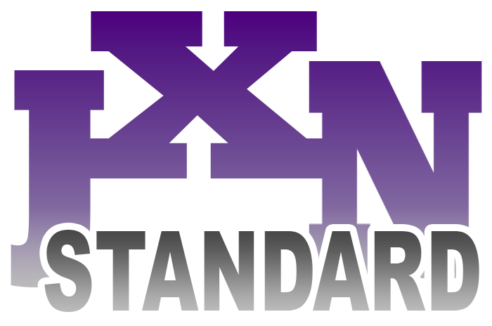

# JunX.NETStandard

<strong>ABOUT THIS SDK LIBRARY</strong>

This SDK Library is compiled using C#.NET Standard 2.0 to allow compatibility between .NET Core and .NET Framework

 

This library contains multiple namespaces that can be useful for encryption/decryption, MySQL, SQL command building, XML & RDLC manipulation, and others.

 
 
<strong>NAMESPACES & DESCRIPTIONS</strong>
<ul>
  <li><strong>JunX.NetStandard.EncryptionService</strong> - Contains classes and methods for symmetric AES encryption or decryption using a specified key.</li>
  <li><strong>JunX.NetStandard.MySQL</strong> - Contains classes, methods & extension methods, structs, and enums necessary for easier MySQL Database manipulation using the MySql.Data.MySqlClient library.</li>
  <li><strong>JunX.NetStandard.OLEDB</strong> - Almost similar in contents and function as that of the NetStandard.MySQL namespace but tailored for OLEDB Database manipulation.</li>
  <li><strong>JunX.NetStandard.SQLBuilder</strong> - Contains classes, methods, structs, and enums necessary for fluently building SQL commands.</li>
  <li><strong>JunX.NetStandard.Utility</strong> - Contains various classes that allows Enum manipulation, Logging, Struct manipulation, and others.</li>
  <li><strong>JunX.NetStandard.XML</strong> - Contains classes, and methods for reading and manipulating XML files and RDLC files.</li>
</ul>
 
<strong>FROM THE DEVELOPER</strong>

This library is a work-in-progress. Contents will be added and refined.

As I am a small-time developer, if you are going to use this library, please credit me. I would highly appreciate it.

If you have any comments or suggestions, please feel free to reach me out via my <a href="https://www.facebook.com/juniB07">Facebook</a>.

Thank you! :)

